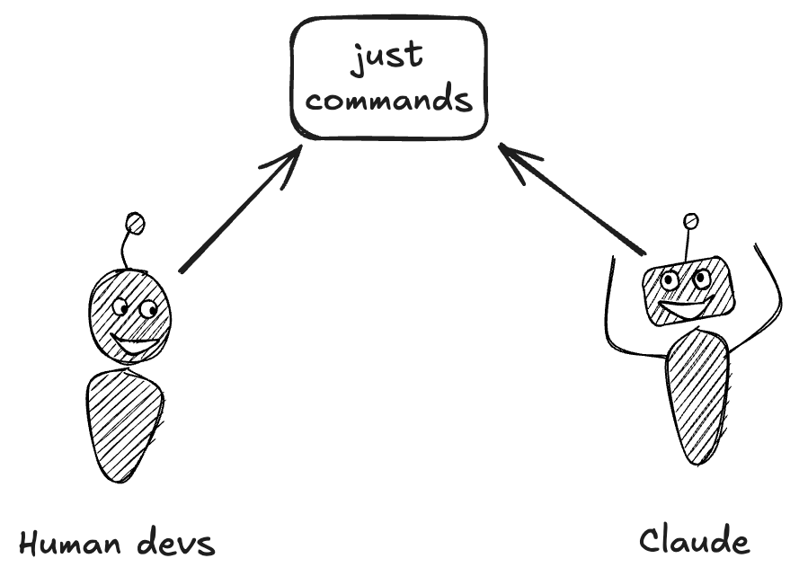

# just-claude

Automatically expose [just](https://github.com/casey/just) recipes as Claude Code skills.

This enables human devs and Claude to share a common toolset:



## Installation

```bash
npm install -g just-claude
```

Then, in your project, run:
```bash
just-claude init
```

This will install a hook which will automatically make any `just` recipes available to Claude via [Claude Agent Skills](https://www.claude.com/blog/skills), and keep them synchronized (via a Claude session hook).

## Requirements

- Node.js 18+
- [just](https://github.com/casey/just) command runner
- [Claude Code](https://claude.com/claude-code)

## Quick Start

```bash
# Install
npm install -g just-claude

# Create a new project
mkdir my-project && cd my-project

# Create a simple justfile with a documented recipe
cat > justfile << 'EOF'
# Say hello (this comment becomes the recipe description)
hello name="world":
    echo "Hello, {{name}}!"
EOF

just-claude init
```

This will modify your Claude settings file, while retaining a backup. The generated skill files can be gitignored.

## Other commands

```bash
# Check what was installed
just-claude status

# Output:
# just command: ✓ available
# justfile: ✓ found
# public recipes: 1
# generated skills: 1
# hook configured: ✓ yes

# See what skills were created
just-claude list

# Output:
# Generated skills:
#   - just-hello

# Check a generated skill
cat .claude/skills/just-hello/SKILL.md

# Remove hook and generated skills
just-claude clean
```


## Develop / Install from Source

```bash
# Clone and build locally
git clone https://github.com/yourusername/just-claude.git
cd just-claude
npm install
npm test

# Install the CLI globally from source
npm install -g .

# Wire up a project (from inside the target repo)
just-claude init
```

## Contributing

See [CONTRIBUTING.md](CONTRIBUTING.md) for development setup and guidelines.

## License

MIT
